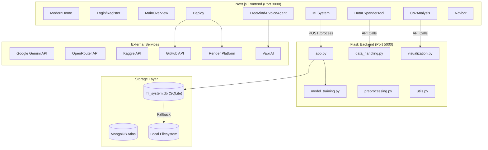

# FreeMindAI – No‑Code Machine Learning Platform

FreeMindAI is a full‑stack, no‑code platform that lets you **build, train, and deploy machine learning models** without writing a single line of code. Upload your data, configure training visually, and export deployable apps or deploy directly to the cloud.

---

## 🌟 Why FreeMindAI?

- **Zero code required** – Intuitive UI for every ML workflow.
- **End‑to‑end** – From data ingestion to model deployment.
- **Multi‑modal support** – Tabular, text, image, and object detection tasks.
- **One‑click deployment** – Export Streamlit apps or deploy to Render via GitHub.
- **AI‑powered data tools** – Generate, expand, and query datasets with LLMs.

---

## 🚀 Quick Start

### Prerequisites
- Node.js 18+
- Python 3.10+
- MongoDB Atlas account

### Environment Variables
Create `.env` in the root:
```env
MONGODB_URI=mongodb+srv://your-connection-string
GOOGLE_API_KEY=your-gemini-api-key
KAGGLE_USERNAME=your-kaggle-username
KAGGLE_KEY=your-kaggle-key
NEXTAUTH_SECRET=your-secret-key
NEXTAUTH_URL=http://localhost:3000
OPENROUTER_API_KEY=your-openrouter-key  # optional
``` [2](#0-1) 

### Run Locally
**Backend (Flask)**
```bash
python -m venv venv
.\venv\Scripts\activate   # Windows
pip install -r requirements.txt
python app.py
```
**Frontend (Next.js)**
```bash
npm install
npm run dev
```
Access at http://localhost:3000 (frontend) and http://localhost:5000 (backend). [3](#0-2) 

### Docker (Production)
```bash
docker-compose up --build
``` [4](#0-3) 

---

## 🧠 Core Features

| Feature | What You Can Do | Tech |
|---------|----------------|------|
| **Model Training** | Classification, regression, NLP, image classification, object detection | scikit‑learn, TensorFlow/Keras, PyTorch + YOLO |
| **Data Sources** | Upload CSV/Excel, Kaggle import, AI‑generated synthetic data, data augmentation | pandas, Kaggle API, Google Gemini AI |
| **Visualizations** | Confusion matrix, ROC/PR curves, feature importance, residual/Q‑Q plots | Plotly.js, matplotlib |
| **Export & Deploy** | Download `.pkl` models, Streamlit app ZIP, one‑click GitHub + Render deployment | GitHub API, Render platform | [5](#0-4) 

---

## 🏗️ Architecture Overview



- **Frontend**: Next.js 16.1 + React 19 + TailwindCSS + NextAuth. [6](#0-5) 
- **Backend**: Flask orchestrates ML pipelines; modules include `model_training.py`, `data_handling.py`, `preprocessing.py`, `visualization.py`, `utils.py`. [7](#0-6) 
- **Storage**: MongoDB Atlas for users/activities; SQLite (`ml_system.db`) via `DBFileSystem` for ML artifacts. [8](#0-7) 
- **External AI**: Google Gemini and OpenRouter for LLM features; Kaggle for datasets; GitHub + Render for deployment. [9](#0-8) 

---

## 📁 Project Structure

```
FreeMindAi/
├── app/                     # Next.js App Router
│   ├── api/                # API routes (auth, deploy)
│   ├── main/               # Dashboard
│   ├── ml/                 # ML training page
│   └── page.js             # Landing
├── components/             # React components
│   ├── ml-system.jsx       # ML training UI
│   ├── DataExpanderTool.jsx
│   ├── CsvAnalysis.jsx
│   ├── Deploy.jsx
│   └── Navbar.jsx
├── models/                 # MongoDB schemas
├── lib/                    # Utilities
├── public/                 # Static assets
├── app.py                  # Flask entry
├── model_training.py       # ML training logic
├── data_handling.py        # Dataset processing
├── preprocessing.py        # Data preprocessing
├── visualization.py        # Charts
├── utils.py                # Helpers
├── dataset_alter_expand.py # Dataset API
├── analysis.py             # CSV analysis API
├── db_file_system.py       # SQLite file storage
├── Dockerfile              # Backend container
├── Dockerfile.frontend     # Frontend container
├── docker-compose.yml      # Orchestration
├── requirements.txt        # Python deps
└── package.json            # Node.js deps
``` [10](#0-9) 

---

## 🔧 Key API Endpoints

| Endpoint | Method | Description |
|----------|--------|-------------|
| `/process` | POST | Train an ML model |
| `/api/datasets` | GET | List datasets |
| `/api/upload-dataset` | POST | Upload a dataset |
| `/api/preview-dataset` | POST | Preview dataset |
| `/download/<filename>` | GET | Download model/app |
| `/api/deploy` | POST | Deploy model to GitHub + Render | [11](#0-10) 

---

## 🐳 Docker Commands

```bash
docker-compose build          # Build images
docker-compose up -d          # Start services
docker-compose logs -f        # View logs
docker-compose down           # Stop services
docker-compose build backend  # Rebuild backend only
``` [12](#0-11) 

---

## 🛠️ Troubleshooting

**Port already in use**
```bash
netstat -ano | findstr :3000
taskkill /PID <PID> /F
``` [13](#0-12) 

---

## 📄 License

Add your license here.

---

## 🤝 Contributing

Contributions are welcome! Please open an issue or submit a pull request.

---

## Notes
- The README above synthesizes information from the existing `README.md`, the project’s architecture wiki, and key implementation files such as `app.py`, `package.json`, and the deployment route `app/api/deploy/route.js`. [1](#0-0) [7](#0-6) [6](#0-5) [9](#0-8) 
- For deeper dives, see the Frontend Architecture, Backend Architecture, Storage Layer, ML Training Pipeline, and Deployment sections in the project wiki.

Wiki pages you might want to explore:
- [Overview (Vinayak0987/FreeMindAi)](/wiki/Vinayak0987/FreeMindAi#1)

### Citations

**File:** README.md (L31-49)
```markdown
┌─────────────────────────────────────────────────────────────┐
│                    FreeMindAI Platform                       │
├──────────────────────────┬──────────────────────────────────┤
│   Next.js Frontend       │        Flask Backend             │
│   (React 19, TailwindCSS)│   (Python, ML Libraries)         │
│   Port: 3000             │        Port: 5000                │
├──────────────────────────┼──────────────────────────────────┤
│   • Modern UI            │   • scikit-learn                 │
│   • Real-time updates    │   • TensorFlow/Keras             │
│   • File uploads         │   • PyTorch + YOLO               │
│   • Visualizations       │   • Google Gemini AI             │
│   • User authentication  │   • Kaggle API                   │
└──────────────────────────┴──────────────────────────────────┘
                              │
                    ┌─────────┴─────────┐
                    │   MongoDB Atlas   │
                    │   (User Data)     │
                    └───────────────────┘
```
```

**File:** README.md (L63-82)
```markdown
Create a `.env` file in the root directory:

```env
# MongoDB
MONGODB_URI=mongodb+srv://your-connection-string

# Google Gemini AI
GOOGLE_API_KEY=your-gemini-api-key

# Kaggle (for dataset downloads)
KAGGLE_USERNAME=your-kaggle-username
KAGGLE_KEY=your-kaggle-key

# NextAuth
NEXTAUTH_SECRET=your-secret-key
NEXTAUTH_URL=http://localhost:3000

# Optional
OPENROUTER_API_KEY=your-openrouter-key
```
```

**File:** README.md (L90-117)
```markdown
**Terminal 1 - Backend (Flask):**
```powershell
# Create virtual environment
python -m venv venv

# Activate (Windows)
.\venv\Scripts\activate

# Install dependencies
pip install -r requirements.txt

# Run Flask server
python app.py
```

**Terminal 2 - Frontend (Next.js):**
```powershell
# Install dependencies
npm install

# Run development server
npm run dev
```

**Access the app:**
- Frontend: http://localhost:3000
- Backend API: http://localhost:5000

```

**File:** README.md (L122-136)
```markdown
```powershell
# Build and run both services
docker-compose up --build

# Run in background
docker-compose up -d

# Stop services
docker-compose down
```

**Access:**
- Frontend: http://localhost:3000
- Backend: http://localhost:5000

```

**File:** README.md (L141-165)
```markdown
```
FreeMindAi/
├── app/                    # Next.js App Router
│   ├── api/               # API routes (auth, projects, etc.)
│   ├── dashboard/         # Dashboard pages
│   └── page.js            # Home page
├── components/            # React components
│   ├── ml-system.jsx     # Main ML training interface
│   └── ...
├── lib/                   # Utility libraries
├── models/                # MongoDB models
├── public/                # Static assets
│
├── app.py                 # Flask backend entry point
├── model_training.py      # ML model training logic
├── visualization.py       # Chart generation
├── data_handling.py       # Dataset processing
├── preprocessing.py       # Data preprocessing
│
├── Dockerfile             # Backend Docker config
├── Dockerfile.frontend    # Frontend Docker config
├── docker-compose.yml     # Multi-container orchestration
├── requirements.txt       # Python dependencies
└── package.json           # Node.js dependencies
```
```

**File:** README.md (L169-196)
```markdown
## 🎯 Features

### 1. Model Training
- **Classification**: Decision Tree, Random Forest, SVM, KNN, Gradient Boosting
- **Regression**: Linear, Ridge, Lasso, Random Forest, XGBoost
- **NLP**: Text classification with TF-IDF
- **Image Classification**: CNN with TensorFlow
- **Object Detection**: YOLOv8

### 2. Dataset Sources
- 📤 **Upload CSV/Excel** files directly
- 🌐 **Kaggle Integration** - Import datasets via URL
- 🤖 **AI Generation** - Create synthetic datasets with prompts
- 🔄 **Data Expansion** - Augment existing datasets

### 3. Visualizations
- Confusion Matrix
- ROC Curves
- Precision-Recall Curves
- Feature Importance
- Residual Plots
- Q-Q Plots

### 4. Export Options
- Download trained models (`.pkl`)
- Ready-to-run Streamlit app (`.zip`)
- Model deployment on Render

```

**File:** README.md (L199-208)
```markdown
## 🔧 API Endpoints

| Endpoint | Method | Description |
|----------|--------|-------------|
| `/process` | POST | Train ML model |
| `/api/datasets` | GET | List datasets |
| `/api/upload-dataset` | POST | Upload dataset |
| `/api/preview-dataset` | POST | Preview dataset |
| `/download/<filename>` | GET | Download model/app |

```

**File:** README.md (L213-229)
```markdown
```powershell
# Build images
docker-compose build

# Start services
docker-compose up -d

# View logs
docker-compose logs -f

# Stop services
docker-compose down

# Rebuild specific service
docker-compose build backend
docker-compose build frontend
```
```

**File:** README.md (L235-240)
```markdown
### Port Already in Use
```powershell
# Find process using port
netstat -ano | findstr :3000

# Kill process
```

**File:** app/api/deploy/route.js (L81-148)
```javascript
      // Step 2: Create GitHub repository (initialized so default branch exists)
      const repoResponse = await octokit.rest.repos.createForAuthenticatedUser({
        name: repoName,
        description: `ML Model deployment created from FreeMindAI - ${modelZip.name}`,
        private: false, // Set to true if you want private repos
        auto_init: true,
        gitignore_template: 'Python'
      });

      const repoUrl = repoResponse.data.html_url;
      const repoFullName = repoResponse.data.full_name;
      const ownerLogin = repoResponse.data.owner.login;
      const defaultBranch = repoResponse.data.default_branch || 'main';

      // Give GitHub a moment to initialize default branch
      await sleep(800);

      // Step 3: Build full commit using Git Data API (avoids per-file 409/422)
      // Collect files from ZIP into a map
      const filesMap = new Map();
      for (const entry of zipEntries) {
        if (entry.isDirectory) continue;
        const filePath = entry.entryName.replace(/^\/+/, ''); // normalize
        filesMap.set(filePath, entry.getData());
      }

      // Add render.yaml (always) and README.md (if not present)
      const renderConfig = `# Render deployment configuration\nservices:\n  - type: web\n    name: ${repoName}\n    env: python\n    buildCommand: pip install -r requirements.txt\n    startCommand: python load_model.py\n    envVars:\n      - key: PYTHON_VERSION\n        value: 3.11\n`;
      filesMap.set('render.yaml', Buffer.from(renderConfig));

      if (!filesMap.has('README.md')) {
        const readmeContent = `# ML Model Deployment\n\n## Overview\nThis repository contains a machine learning model deployed from FreeMindAI.\n\n**Model File:** ${modelZip.name}\n**Size:** ${modelSizeMB.toFixed(2)} MB\n**Created:** ${new Date().toISOString()}\n\n## Quick Deploy\n\n### Deploy to Render\n1. Connect this GitHub repository to Render\n2. Use the following settings:\n   - **Build Command:** \`pip install -r requirements.txt\`\n   - **Start Command:** \`python load_model.py\`\n   - **Python Version:** 3.11\n\n### Local Development\n\`\`\`bash\npip install -r requirements.txt\npython load_model.py\n\`\`\`\n\n## Files\n${zipFileNames.map(file => `- ${file}`).join('\n')}\n\n---\n*Generated by FreeMindAI*`;
        filesMap.set('README.md', Buffer.from(readmeContent));
      }

      // Fetch base commit sha for default branch
      const ref = await octokit.rest.git.getRef({ owner: ownerLogin, repo: repoName, ref: `heads/${defaultBranch}` });
      const baseCommitSha = ref.data.object.sha;

      // Create blobs and tree entries
      const treeEntries = [];
      for (const [p, buf] of filesMap.entries()) {
        const blob = await octokit.rest.git.createBlob({ owner: ownerLogin, repo: repoName, content: buf.toString('base64'), encoding: 'base64' });
        treeEntries.push({ path: p, mode: '100644', type: 'blob', sha: blob.data.sha });
      }

      // Create a new tree based on base commit
      const newTree = await octokit.rest.git.createTree({ owner: ownerLogin, repo: repoName, base_tree: baseCommitSha, tree: treeEntries });

      // Create a commit
      const commit = await octokit.rest.git.createCommit({ owner: ownerLogin, repo: repoName, message: 'Add model files and deployment config', tree: newTree.data.sha, parents: [baseCommitSha] });

      // Update branch ref to point to new commit
      await octokit.rest.git.updateRef({ owner: ownerLogin, repo: repoName, ref: `heads/${defaultBranch}`, sha: commit.data.sha, force: true });

      // Return success response with real GitHub URLs
      return NextResponse.json({
        success: true,
        deployment_id: repoName,
        model_file: modelZip.name,
        model_size: `${modelSizeMB.toFixed(2)} MB`,
        status: 'github_deployed',
        github_url: repoUrl,
        github_repo: repoFullName,
        render_url: `https://dashboard.render.com/create?repo=${repoUrl}`,
        files_uploaded: zipFileNames.length,
        message: `Successfully created GitHub repository '${repoName}' with ${zipFileNames.length} files from your ML model ZIP.`
      });
```
