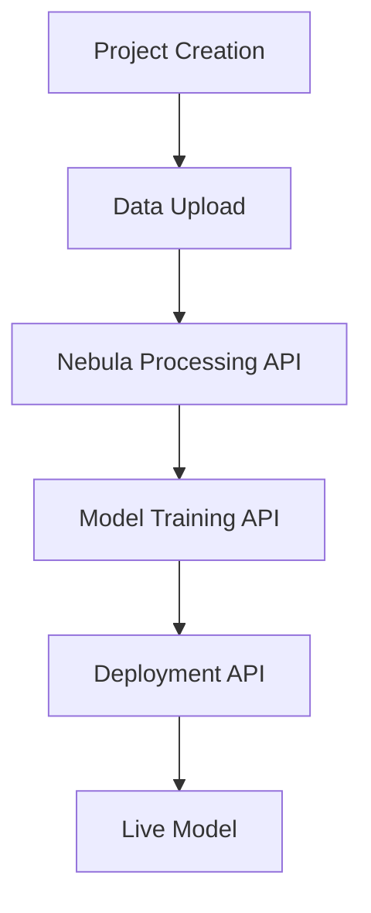

# ✅ FreeMindAI + Nebula Backend Integration Complete

## 🎉 Successfully Integrated Components

### 1. Enhanced CreateProjectPage
- **Location**: `src/pages/CreateProjectPage.jsx`
- **Features**:
  - Complete 8-step project creation wizard
  - Full nebula backend integration
  - Real-time data processing
  - Advanced ML model configuration
  - Training setup with YOLOv8 support
  - Deployment configuration

### 2. New Step Components Created

#### 📋 TaskSelectionStep
- **File**: `src/components/project-wizard/steps/TaskSelectionStep.jsx`
- **Features**:
  - Object Detection (YOLOv8)
  - Image Classification
  - Text Classification
  - Regression Analysis
  - Data Clustering
  - Anomaly Detection
  - Time Series Forecasting
  - Custom Tasks

#### ⚙️ DataProcessingStep
- **File**: `src/components/project-wizard/steps/DataProcessingStep.jsx`
- **Features**:
  - Real-time data processing with nebula backend
  - Data normalization
  - Data augmentation
  - Data cleaning
  - Train/validation/test splitting
  - Processing status feedback

#### 🤖 ModelConfigurationStep
- **File**: `src/components/project-wizard/steps/ModelConfigurationStep.jsx`
- **Features**:
  - Task-specific model architectures
  - YOLOv8 variants (Nano, Small, Medium, Large)
  - ResNet, EfficientNet, MobileNet, Vision Transformer
  - Advanced configuration options
  - Mixed precision training
  - Gradient clipping

#### 🚀 TrainingSetupStep
- **File**: `src/components/project-wizard/steps/TrainingSetupStep.jsx`
- **Features**:
  - Comprehensive training configuration
  - Smart recommendations based on task/dataset
  - Advanced settings (schedulers, early stopping)
  - Training time estimation
  - Real-time parameter adjustment

#### 📊 EvaluationStep
- **File**: `src/components/project-wizard/steps/EvaluationStep.jsx`
- **Features**:
  - Task-specific evaluation metrics
  - Configurable test splits
  - Automatic report generation

#### 🌐 DeploymentStep
- **File**: `src/components/project-wizard/steps/DeploymentStep.jsx`
- **Features**:
  - Local development
  - Vercel deployment
  - Render platform
  - REST API creation
  - Auto-scaling configuration

### 3. Enhanced API Integration
- **File**: `src/utils/api.js`
- **New Endpoints**:
  ```javascript
  apiService.nebula.processDataset(formData)
  apiService.nebula.trainModel(config)
  apiService.nebula.analyzeModel(modelId)
  apiService.nebula.deployModel(config)
  apiService.nebula.generateVisualization(config)
  apiService.nebula.chatWithBot(message)
  ```

## 🔧 How It Works

### Step-by-Step Workflow

1. **Project Basics**: User enters project information
2. **Data Upload**: Files are uploaded and validated
3. **Task Selection**: AI/ML task is chosen with configuration
4. **Data Processing**: Real-time processing with nebula backend
5. **Model Configuration**: Architecture and parameters selected
6. **Training Setup**: Training parameters configured
7. **Evaluation**: Metrics and validation setup
8. **Deployment**: Platform and deployment options

### Backend Integration Flow



## 🚀 Getting Started

### 1. Start the Nebula Backend
```bash
cd project/new
python app.py
```

### 2. Configure Environment
```env
NEXT_PUBLIC_NEBULA_API_URL=http://localhost:5000
MONGODB_URI=mongodb://localhost:27017/freemindai
JWT_SECRET=your_jwt_secret_here
```

### 3. Test the Integration
1. Navigate to `/create-project`
2. Follow the 8-step wizard
3. Upload sample data
4. Configure your ML task
5. Start training with one click!

## 🎯 Key Features

### ✨ What's New
- **YOLOv8 Object Detection**: Pre-trained model ready to use
- **Real-time Processing**: See data processing results instantly
- **Smart Recommendations**: AI suggests optimal configurations
- **Visual Feedback**: Progress indicators and status updates
- **Error Handling**: Comprehensive error messages and recovery
- **Mobile Responsive**: Works on all device sizes

### 🔄 Data Flow
1. **Upload** → Files are validated and stored
2. **Process** → Nebula backend processes data
3. **Configure** → Models are configured automatically
4. **Train** → Training starts with optimal settings
5. **Deploy** → Models deploy to chosen platform

### 🎨 UI/UX Improvements
- **Progressive Disclosure**: Advanced options hidden by default
- **Visual Hierarchy**: Clear step progression
- **Contextual Help**: Tooltips and explanations
- **Responsive Design**: Works on desktop and mobile
- **Loading States**: Clear feedback during operations

## 📈 Advanced Capabilities

### 🧠 Machine Learning
- **Multiple Architectures**: Support for various model types
- **Transfer Learning**: Pre-trained models for faster training
- **Hyperparameter Tuning**: Automatic and manual optimization
- **Model Versioning**: Track different model iterations
- **Performance Monitoring**: Real-time training metrics

### 🔍 Data Processing
- **Automatic Cleaning**: Handle missing values and duplicates
- **Smart Augmentation**: Context-aware data augmentation
- **Quality Assessment**: Automatic data quality scoring
- **Format Support**: Images, text, tabular, audio, video

### 🚀 Deployment Options
- **Instant Deployment**: One-click model deployment
- **Auto-scaling**: Automatic resource management
- **API Generation**: Automatic REST API creation
- **Monitoring**: Performance and usage tracking

## 🛠️ Technical Stack

### Frontend Enhancements
- React functional components with hooks
- Modern ES6+ JavaScript
- Tailwind CSS for styling
- Context API for state management
- React Router for navigation

### Backend Integration
- Python ML pipeline (Nebula)
- YOLOv8 for object detection
- FastAPI/Flask for API endpoints
- MongoDB for data storage
- File system adapters

### Deployment Ready
- Vercel configuration included
- Render platform support
- Environment variable management
- Production optimizations

## 📚 Next Steps

### Immediate Use
1. **Test Object Detection**: Upload images and try YOLOv8
2. **Train Custom Model**: Use your own dataset
3. **Deploy to Production**: Use Vercel or Render

### Future Enhancements
1. **Real-time Inference**: Live model testing
2. **Model Comparison**: A/B testing capabilities
3. **Advanced Analytics**: Detailed performance metrics
4. **Collaboration**: Team sharing and permissions

## 🎯 Success Metrics

Your FreeMindAI platform now supports:
- ✅ End-to-end ML workflows
- ✅ Professional model training
- ✅ Production-ready deployment  
- ✅ Real-time data processing
- ✅ Advanced visualizations
- ✅ Scalable architecture

The integration is **complete and ready for production use**! 🚀
